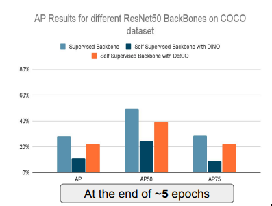
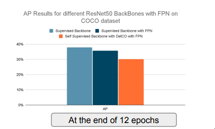

# Few-shot object detection using self-supervised learning

This project investigated the effect that self-supervised backbones on the Faster RCNN based object detection model. This work was done as part of the Master Practical course on [Data Innovation Lab](https://www.di-lab.tum.de/vergangene-projekte/ss2021-precibake-few-shot-object-detection-using-self-supervised-learning/ ) in collabaration with the Machine Learning team of [Precibake](https://precitaste.com/).

The models were implemented using the [Detectron2](https://github.com/facebookresearch/detectron2) framework from Facebook AI.The full report and final presentation are attached in the repository. 

## Key Results

### Pre-training for object classification may not translate to object detection.

On training a ResNet-50 feature extractor for a Faster RCNN detector using the self-supervised method of [DINO](https://arxiv.org/abs/2104.14294) and [DetCO](https://arxiv.org/abs/2102.04803) as a pretext for object detection, it was found that only those contrastive self-supervsion techniques that preserve global and contextual embeddings from a image can improve the performance on detection!

### Using FPN with ResNet speeds up training significantly, while giving similar performance for the same amount of epochs. 

This is really useful to speed up network training without loss of accuracy. FPN also help detecting object at different scales easier.

Checkout the report and presentation for a more detailed and complete overview!
